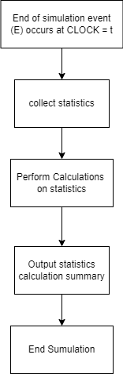
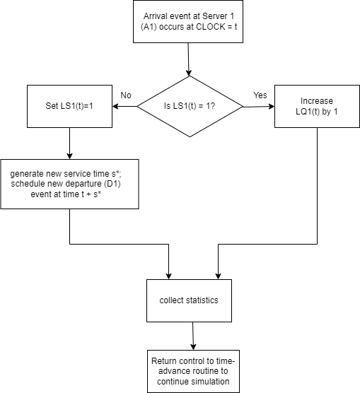
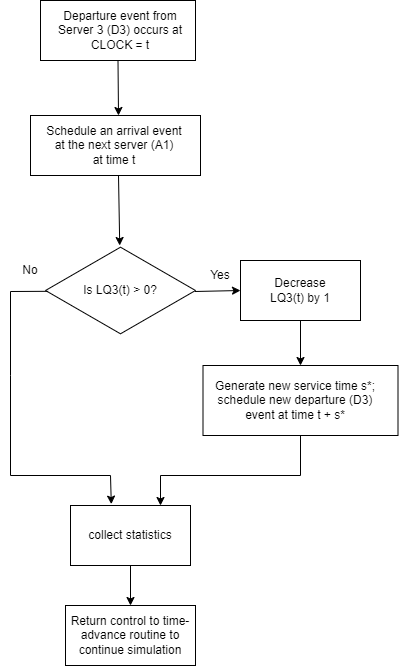
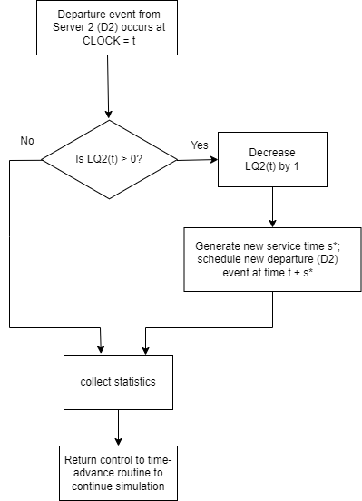

**Simulation of Sandwich Shop**

` `**Contents**

[**I. Introduction](#_5bzbhxmpx9zd)	**4****

[**II. Problem Formulation](#_dmma7ts8k1n)	**4****

[**III. Objectives and Overall Project Plan](#_w3dczdpevc7e)	**5****

[**IV. Model Conceptualization](#_6bl08pc0er0t)	**6****

[**V. Data Collection](#_6hhufjk258vz)	**7****

[**VI. Model Translation](#_3wosbdt1c71s)	**12****

[**VII. Data Conversion into Equations for Generation of Interarrival and Service times](#_24w2p9rll0u4)	**20****

[**VIII. Code Discussion](#_d17b6yfmpfpa)	**24****

[**IX. Verification using Tracing](#_ms8596jo1se1)	**32****

[**X. Validation](#_vlulb02lx8eh)	**38****

[**XI. Experimental Design](#_62gdhpjxk403)	**39****

[**XII. Production Runs and analysis](#_8wmmikk7n7xs)	**44****

[**XIII. Summary and concluding results](#_gofrghkqvgb)	**48****

[**Appendix I](#_hys70ossbw1)	**49****

**List of figures**

- Figure 1: Abstract Figure for the Sandwich Shop
- Figure 2: Project Proposal 1 for the Shop
- Figure 3: Project Proposal 2 for the Shop
- Figure 4: Arrival event at Queue 1/Server 1 (A1)	
- Figure 5: Arrival event at Queue 2/Server 2 (A2)
- Figure 6. Arrival event at Queue 3/Server 3 (A3)
- Figure 7. Departure event from Server 1 (D1)
- Figure 8. Departure event from Server 2 (D2)
- Figure 9. Departure event from Server 3 (D3)
- Figure 10. End of simulation event
- Figure 11. Comparison of interarrival times cdf with that of a normal, exponential and uniform distribution that all have the same average (and standard deviation when necessary) as the original data.
- Figure 12. Comparison of service time for server 1’s cdf with that of a normal, exponential and uniform distribution that all have the same average (and standard deviation when necessary) as the original data.
- Figure 13. Comparison of service time for server 2’s cdf with that of a normal, exponential and uniform distribution that all have the same average (and standard deviation when necessary) as the original data.
- Figure 14. Comparison of service time for server 3’s cdf with that of a normal, exponential and uniform distribution that all have the same average (and standard deviation when necessary) as the original data.
- Figure 15: Arrival event at Queue 1/Server 1 (A1) for scenario 2
- Figure 15: Arrival event at Queue 3/Server 3 (A3) for experiment 2
- Figure 16: Arrival event at Queue 1/Server 1 (A1) for experiment 2
- Figure 17: Departure event from Queue 3/Server 3 (D3) for experiment 2
- Figure 18: Departure event from Queue 2/Server 2 (D2) for experiment 2	

**List of tables:**

- Table 1: Interarrival Distribution Table
- Table 2: Service Time Distribution for S1
- Table 3: Service Time Distribution for S2
- Table 4: Service Time Distribution for S3

1. # **Introduction**

In this project, we are planning to open a new, more efficient, sandwich shop that will be as efficient as serving clients as possible. We will use existing sandwich shops to study the currently used model and test some proposed improvements. The current system consists of three servers, the first involves preparing the main components (bread, meat or substitutes, and/or cheese) of the sandwich and (optionally) toasting it. The second station involves adding the toppings to the previously prepared sandwich and wrapping it. The third and final station is the cash register. Each of these stations operate linearly and have a queue before each station. Figure 1 shows the abstract view for the main components of our system.

*Figure 1 Abstract figure for a sandwich shop*

To achieve this purpose, we have visited a typical sandwich shop (Subway) several times in order to observe the services’ progress. We measured interarrival times to the system as well as service times for each of the three servers.
1. # **Problem Formulation**

Based on our observations to the system under study, we can describe the process in the following steps:

1. Customers enter the first queue to select their type of sandwich, bread, meat, and cheese. They also specify whether or not they would like their sandwich to be toasted or not. Based on the data collected, the expected interarrival time of the customer is ~97.2 seconds.
1. Customers go to the ‘toppings’ station, where they select the other desired ingredients. Here, a server will add the desired toppings to the customer’s sandwich. The customer may choose to forgo toppings, however they must still pass through this station, so that the sandwich can be wrapped. Occasionally, this station may use up a particular ingredient, forcing the worker to fetch another container.
1. The sandwich is placed in a bag and the customer may choose to add extra pre-packaged items, such as chips, beverages, or desserts before paying. The customer then leaves the system.

Usually, customers take around 1 to 3 minutes at server 1. However, customers might face delays based on the order placed by the previous customer in the queue.

In addition, we are making the following assumptions:

- Each station has one worker at a time. Although we occasionally observed that when one station became overburdened, a worker from another station, typically station 3, would become a parallel server to the station that was slow and help clear the backlog.
- Some customers may be ordering multiple sandwiches at once, however they will proceed one step at a time and not return to a previous step order with their next sandwich.
- All customers will choose something offered on the shop’s menu by the time they reach the first server, likely because they did not join the first queue until they had decided.
- There will be no grave accidents or circumstances surrounding the system, such as natural disasters, car accidents in very proximity to the shop, kitchen fires, or medical emergencies.
- When two or more people arrive simultaneously, they are counted as individual customers as long as they pay and order individually. If a family or other group arrived and ordered as one, they were counted as a single customer.
# **III. Objectives and Overall Project Plan**

In this project, we are going to evaluate the system in order to open a sandwich shop that more efficiently serves customers. We are going to answer the following questions:

- **Can we have an additional server parallel to server 1?**

The first station tends to take almost an equal amount of time as that of server one, mainly due to toasting the bread, adding toppings that are to be put in the oven along with the bread and customer interaction. Adding a parallel server on spot one can potentially speed the serving time.  

An alternative system could entail adding a second server to the first station. This new system would have 2 servers (1a and 1b)  which would both offer the same services server 1 in the original model. Figure 2 contains a visual example.

**Server 1a**

**Server 1b**

**Queue 2**

**Server 2**

**Queue 3**

**Queue 1**

**Server 3**

*Figure 2. System Proposal 1*

- **Can we rearrange the servers?**

Server three has the least amount of service time among the other servers and is independent of server two and server one; having server three at the very beginning of the serving system, the server can collect the payment while helping the customer decide to place the order, taking some workload off of server one. This can reduce the service time of server one.

*Figure 3. System Proposal 2*

- **Can we train server two to make the system more efficient?**

Since server two has the highest serving time, the goal of this simulation is to find if the serving time totally depends on the customer or can we train server two to make the system more efficient by reducing the serving time. That is to say, if we hire a more experienced server who can provide shorter service times for server 1  , would it be worth the higher salary we would need to offer?

**Resources required**

In this project we estimate the number of resources needed as follows:

- 2 people for 3 days for data collection
- 2 people for 3 days for data analysis
- 2 people for 2 days for model building
- 2 people for 2 days for report writting
# **IV. Model Conceptualization** 

<table><tr><th valign="top">System</th><th colspan="2" valign="top">Sandwich restaurant</th></tr>
<tr><td rowspan="2" valign="top">

Entities
</td><td valign="top">Taken entities</td><td valign="top">Non-taken entities</td></tr>
<tr><td valign="top">
- Customers

- Servers

- Sandwiches
</td><td valign="top">
- Payment Types (credit card, cash, debit card, gift card etc.)

- Stations
</td></tr>
<tr><td valign="top">Attributes</td><td colspan="2" valign="top">
- Toppings chosen

- Type of Sandwich

- Toasted or Not

- Worker Salaries

- Total Transaction Cost

- Type of Payment

- Amount Tipped

- Other Products Purchased
</td></tr>
<tr><td valign="top">Events</td><td colspan="2" valign="top">
- Arrival at server 1, 2, and 3

- Arrival at queue of server 1, 2, and 3

- Service completion by server 1, 2, and 3
</td></tr>
<tr><td valign="top">Activities</td><td colspan="2" valign="top">
- Ordering the main component of the sandwich

- Getting the toppings

- Making a payment

- Waiting in a queue
</td></tr>
<tr><td valign="top">State variables</td><td colspan="2" valign="top">
- Number of customers in queue 1, 2, and 3

- Idle state of server 1, 2, and 3 

- Whether or not an ingredient needs to be refilled
</td></tr>
</table>

The entities such as payment types are not taken into account in our modelling as they are not the main focus of this study.
# **V. Data Collection**

A list of 100 data points were collected from 10/12/2022 until 10/19/2022 in order to study the system. The data was taken in situ, recording the customer arrival times as well as the start and stop times for each of the three servers. The data was recorded using a shared spreadsheet in google sheets.

Using this data, we were able to obtain interarrival times by calculating the time interval between two subsequent arrivals. We were extremely careful to accurately collect interarrival times and didn’t need to exclude any further data. (It is important to note that the interarrival times between data collection sessions were not calculated, as they would have introduced a great deal of error)

Interarrival Times (in seconds): 204, 70, 221, 93, 400, 33, 95, 102, 16, 04, 379, 4, 4, 163, 29, 5, 1, 53, 7, 160, 67, 177, 131, 40, 37, 159, 58, 11, 92, 1, 23, 1, 107, 1, 111, 20, 21, 89, 2, 59, 153, 174, 2, 88, 1, 1, 188, 166, 65, 2, 58, 278, 1, 42, 58, 81, 173, 4, 185, 144, 96, 73, 203, 30, 1, 431, 15, 191, 82, 264, 2, 95, 51, 58, 37, 488, 9, 242, 161, 11, 18, 146, 48, 5, 111, 128, 1, 265, 96, 227, 16, 77,121,385, 2, 37, 21, 05, 76, 6				

The second type of data collected was the beginning and ending times for the servers. The difference between the stop and start times was used to calculate the service times for server 1. Whilst collecting data for the service times, occasionally we would miss a start or stop time, these data points were simply omitted from the final count.

|Server number|Service times (in seconds)|
| :- | :- |
|1|46, 36, 20, 24, 71, 44, 17, 47, 9, 22, 16, 13, 17, 23, 43, 33, 48, 165, 109, 200, 174, 88, 92, 158, 121, 64, 38, 62, 79, 113, 184, 514, 254, 158, 300, 314, 170, 149, 474, 480, 210, 97, 84, 74, 121, 129, 79, 97, 139, 117, 64, 92, 115, 77, 76, 86, 52, 109, 159, 33, 79, 121, 61, 73, 100, 120, 107, 169, 39, 22, 69, 57, 143, 66, 43, 52, 28, 67, 64, 52, 48, 41, 39, 44, 30, 58, 35, 47, 46, 15, 25, 12, 53, 8, 48, 52, 52, 54, 112|
|2|7, 32, 27, 17, 26, 32, 40, 66, 27, 77, 24, 12, 13, 21, 35, 56, 115, 172, 166, 86, 73, 159, 91, 69, 46, 63, 90, 96, 54, 57, 49, 48, 44, 39, 86, 31, 46, 76, 61, 53, 42, 28, 34, 42, 48, 55, 61, 59, 95, 28, 55, 81, 24, 37, 62, 79, 54, 52, 87, 33, 53, 80, 78, 46, 36, 68, 29, 41, 28, 54, 87, 84, 22, 105, 65, 115, 61, 56, 42, 56, 40, 79, 43, 97, 44, 52, 58, 36, 49, 45, 49, 53, 59, 60, 43, 82, 62, 64, 54, 105|
|3|44, 18, 16, 13, 30, 48, 1, 44, 49, 68, 68, 47, 7, 33, 16, 6, 62, 8, 19, 6, 10, 28, 7, 23, 18, 7, 43, 26, 17, 38, 18, 23, 15, 12, 16, 44, 8, 51, 30, 29, 36, 38, 13, 20, 56, 48, 15, 38, 31, 25, 30, 24, 89, 22, 34, 54, 20, 38, 24, 25, 16, 49, 37, 77, 36, 10, 28, 14, 21, 30, 42, 37, 73, 18, 47, 28, 21, 22, 13, 14, 26, 51, 8, 42, 13,40, 32, 16, 48, 19, 25, 60, 29, 13, 18, 15, 64, 42, 79, 58|

Using the above data, we determined that the minimum value for any of the times was 1 second and the maximum value was 514 seconds. The data was too precise and had to be subcategorized into appropriate intervals to give us a discrete distribution. The intervals and corresponding categories (the average value of the intervals) are as follows:

15 seconds → [0, 30[

45 seconds → [30, 60[

75 seconds → [60, 90[

105 seconds → [90, 120[

135 seconds → [120, 150[

165 seconds → [150, 180[

195 seconds → [180, 210[

225 seconds → [210, 240[

255 seconds → [240, 270[

285 seconds → [270, 300[

315 seconds → [300, 330[

345 seconds → [330, 360[

375 seconds → [360, 390[

405 seconds → [390, 420[

435 seconds → [420, 450[

465 seconds → [450, 480[

495 seconds → [480, 510[

525 seconds → [510, 540[

Each server only uses the times that they need according to the data, so any categories without data points are omitted from that specific distribution table

In Table 1 we have formed the distribution for the interarrival times for the system. The min interarrival time was 15 seconds with a probability of 0.35, and the maximum interarrival time was 495 seconds with a probability of 0.01. The expected interarrival time is 97.2 seconds with a standard deviation of 102.14128 seconds.

Table 1 Interarrival Distribution Table

|Random digit Assignment|Cumulative Probability|Probability|Frequency|Time Between arrivals (seconds)|
| :-: | :-: | :-: | :-: | :-: |
|` `01-35|0\.35|0\.35|35|15|
|36-50|0\.50|0\.15|15|45|
|51-60|0\.60|0\.10|10|75|
|61-70|0\.70|0\.10|10|105|
|71-75|0\.75|0\.05|5|135|
|76-84|0\.84|0\.09|9|165|
|85-89|0\.89|0\.05|5|195|
|90-91|0\.91|0\.02|2|225|
|92-94|0\.94|0\.03|3|255|
|95|0\.95|0\.01|1|285|
|96-97|0\.97|0\.02|2|375|
|98|0\.98|0\.01|1|405|
|99|0\.99|0\.01|1|435|
|00|1\.00|0\.01|1|495|

In table 2, we have formed the distribution for the service times for the server 1. The min service time was 15 seconds with a probability of 0.15, and the maximum service time was 525 seconds with a probability of 0.01. The expected service time for server 1 is 94.8 seconds with a standard deviation of 93.21954 seconds.

Table 2 Service time distribution for S1

|Random digit Assignment|Cumulative Probability|Probability|Frequency|Service Time (seconds)|
| :-: | :-: | :-: | :-: | :-: |
|01-15|0\.15|0\.15|15|15|
|16-45|0\.45|0\.30|30|` `45|
|46–64|0\.64|0\.19|19|` `75|
|65-76|0\.76|0\.12|12|` `105|
|77-84|0\.84|0\.08|8|` `135|
|85-91|0\.91|0\.07|7|` `165|
|92-93|0\.93|0\.02|2|` `195|
|94|0\.94|0\.01|1|225 |
|95|0\.95|0\.01|1|255|
|96-97|0\.97|0\.01|2|315|
|98|0\.98|0\.01|1|465|
|99|0\.99|0\.01|1|495|
|00|1\.00|0\.01|1|525|

In table 3, we have formed the distribution for the service times for the server 2. The min service time once combined was 15 seconds with a probability of 0.15, and the maximum service time was 165 seconds with a probability of 0.03. The expected service time for server 2 is 57.3 seconds with a standard deviation of 31.20433 seconds.

Table 3 Service time distribution for S2

|Random digit Assignment|Cumulative Probability|Probability|Frequency|Service Time (seconds)|
| :-: | :-: | :-: | :-: | :-: |
|01-15 |0\.15 |` `0.15|15 |15|
|` `16-62|` `0.62|0\.47|` `47|` `45|
|63-88|0\.88|0\.26|26|` `75|
|` `89-97|` `0.97|` `0.09|` `9|` `105|
|` `98-00|1\.00|` `0.03|3|165|

In table 4, we have formed the distribution for the service times for the server 3. The min service time once combined was 15 seconds with a probability of 0.55, and the maximum service time was 75 seconds with a probability of 0.09. The expected service time for server 3 is 31.2 seconds with a standard deviation of 19.6358 seconds.

Table 4 Service time distribution for S3

|Random digit Assignment|Cumulative Probability|Probability|Frequency|Service Time (seconds)|
| :-: | :-: | :-: | :-: | :-: |
|` `01-55|` `0.55|0\.55 |55 |` `15|
|` `56-91|` `0.91|` `0.36|` `36|` `45|
|92-00|1\.00|0\.09|9|75|

# 
# **VI. Model Translation**

|List of Events used in the diagrams|List of States used in the diagrams|
| :-: | :-: |
|
- Arrival at Server 1 (A1,t)

- Departure from Server 1 (D1,t)

- Arrival at Server 2 (A2,t)

- Departure from Server 2 (D2,t)

- Arrival at Server 3 (A3,t)

- Departure from Server 3 (D3,t)

- End of simulation event (E,t)
|
- LS1(t) number of clients in server 1

- LS2(t) number of clients in server 2

- LS3(t) number of clients in server 3

- LQ1(t) number of clients in queue 1

- LQ2(t) number of clients in queue 2

- LQ3(t) number of clients in queue 3
|

*Figure 4. Arrival event at Queue 1/Server 1 (A1)*	

*Figure 5. Arrival event at Queue 2/Server 2 (A2)*

*Figure 6. Arrival event at Queue 3/Server 3 (A3)*

*Figure 7. Departure event from Server 1 (D1)*

*Figure 8. Departure event from Server 2 (D2)*

*Figure 9. Departure event from Server 3 (D3)*

*Figure 10. End of simulation event*

# **VII. Data Conversion into Equations for Generation of Interarrival and Service times**
For the interarrival time, we chose an exponential model with a rate equal to 1/97.2 or 1 over the average as it modelled the collected data most faithfully 

*Figure 11. Comparison of interarrival times cdf with that of a normal, exponential and uniform distribution that all have the same average (and standard deviation when necessary) as the original data.*

Using this result, we can generate our interarrival times by reversing the exponential equation:

y = 97.2\*ln(11-x)

By generating a number in the range [0,1], and inserting it into the above equation, and rounding to the nearest whole number, we are able to fairly accurately generate interarrival times.

This equation is used in the generatearrival() function described below.

For the server 1’s service time, once again the exponential equation is the best fit for the data

*Figure 12. Comparison of service time for server 1’s cdf with that of a normal, exponential and uniform distribution that all have the same average (and standard deviation when necessary) as the original data.*

Using the same logic as in the interrarrival times above, we obtain the following equation for data generation, that is used in the generateS1() function:

y = 91.65\*ln(11-x)

For the server 2’s service time, once again the exponential equation is the best fit for the data

*Figure 13. Comparison of service time for server 2’s cdf with that of a normal, exponential and uniform distribution that all have the same average (and standard deviation when necessary) as the original data.*

Using the same logic as in the interrarrival times above, we obtain the following equation for data generation, that is used in the generateS2() function:

y = 57.3\*ln(11-x)

For the server 3’s service time, none of the models seem to adequately model it but since most of the data is shown to be within the first 15 second (0.6 in our model), we want the distribution that gives us the largest early increase in our data values, so we will select, once again the exponential distribution.

*Figure 14. Comparison of service time for server 3’s cdf with that of a normal, exponential and uniform distribution that all have the same average (and standard deviation when necessary) as the original data.*

Using the same logic as in the interarrival times above, we obtain the following equation for data generation, that is used in the generateS3() function:

y = 31.2\*ln(11-x)

# **VIII. Code Discussion**
In this section, we will discuss a list of classes and their purposes.

**EventType Class:** this class defines the three different types of events that an Event can have.     

- *Arrival, Departure* and *End* (which is short for End of Simulation) typed Events.

**Event Class:** this class creates Event objects that store the following information :

- *EventType type*: stores the Event’s EventType
- *Int server:* stores the server number the event belongs to
- *Double duration:* stores the clock value when the event occurs
- *Double eventTime*: stores the randomly generated time for the Event (only used for arrival type events to store interarrival times)

Constructors:

|
/\*\* This constructor is used to create End of Simulation Events. We only need to declare at what clock value this event will occur, and store it in variable duration. We also need to let the program know that it is of type End (End of Simulation) which is stored in variable type. \*\*/

Public Event(double duration, EventType type){}

/\*\* This constructor is used to create Arrival and Departure Events except for arrival events belonging to server 1. Not only do we need to declare the clock value when the events will occur and the type of Event, we also need to let the program know which server this event belongs to. ie) Differentiate a Departure event belonging to server 2 or server 3. \*\*/ Public Event(int server, double duration, EventType type){}

/\*\* This constructor is used to create Arrival Events for server 1. It helps keep track of what the actual interarrival time generated was, since interarrival time is difficult to calculate during the simulation. This value is stored in variable eventTime. The variable clock stores the clock value at which the interarrival time was generated. This way, the clock value at which the arrival time should occur (stored in variable duration) can be generated by clock + interarrival time. \*\*/ Public Event(int server, double clock, double eventTime, EventType type{}
|
| :- |

Getters:

|*// Returns the interarrival time generated if there is one Public double getEventTime(){}  // Returns the clock value at which the event occurs at Public double getDuration(){}  // Returns the integer representation of the server the Event belongs to Public int getServer(){}  // Returns the string representation of the Event Type of an Event Public String getClassName(){}  // Returns the actual Event Type of an Event Public EventType getEventType(){}*|
| :- |

**EventList Class:** this class creates iterable EventList objects that stores information such as:

- *LinkedList<Event> el*: stores all the Events that have yet to be processed

Constructors:

|*// Creates a new EventList object. Contains a LinkedList of Events called el. Public EventList(){}*|
| :- |

Getters:

|// Returns the head Event from an EventList object. Public Event eHead(){}  // Removes the head Event from an EventList object and returns it. Public Event getEvent(){}|
| :- |

Others: 

|/\*\* Returns an iterable Event List el. This makes printing each value stored in an Event List much easier and helps with debugging. \*\*/ Public Iterator<Event> iterator(){}  /\*\* Adds an Event e to the list of Events in an EventList by calling method place() \*\*/ Public void addEvent(Event e){}  /\*\* This method places the Event e that is to be added to an EventList in the correct sequence. It places the Event in increasing order so that events that occur at an earlier time are placed first. It also prioritizes Departure events over Arrival events and Arrival events over End of Simulation events in the case that these events occur at the same clock value. \*\*/ Private void place(Event e){}|
| :- |

**Server Class:** the Server class creates Server objects that store information such as:

- *Int queue*: an integer representation of how long the queue is 
- *Int processing*: an integer that represents whether or not the server is busy (1 means busy, 0 means idle)
- *Int maxQueue*: stores the maximum length of a queue in one simulation

Constructors:

|*/\*\* A constructor for the Server class that sets queue length to 0, its busy status to 0 and max queue length to 0. \*\*/ Public Server(){}*|
| :- |

Getters:

|*// Returns the maximum queue length Public int getMaxQueue(){}  /\*\* Returns 1 if the server is busy and 0 if the server is idle. (This helps calculate the total server busy time) \*\*/ Public int getProcessing(){}  // Returns the queue length. Public int getQueueLength(){}  // Returns true if the server is currently busy and false if it is idle. Public boolean isBusy(){}*|
| :- |

Setters:

|/\*\* Increments the queue length and calls method determineMaxQueue() to see if the current length of the queue is the maximum seen so far. \*\*/ Public void addToQueue(){}  // Decreases the queue length by 1.  Public void removeFromQueue(){}  // Sets the variable processing (busy state) to 1 Public void service(){}  // Sets the variable processing (busy state) to 0 Public void setIdle(){}|
| :- |

Others:

|*/\*\* Determines if the current queue length is the maximum that has been seen so far. Takes the length of the queue as its parameter. \*\*/ Private void determineMaxQueue(int queueLength){}*|
| :- |

**GenerateTimes Class:** the GenerateTimes class is a static class that generates randomized interarrival times, server 1 service times, server 2 service times and server 3 service times

- *Random rnd*: creates a Random object called rnd
- *Static boolean arrivalDebug*: toggle on to help the debugging process
- *Static boolean s1Debug*: toggle on to help the debugging process
- *Static boolean s2Debug*: toggle on to help the debugging process
- *Static boolean s3Debug*: toggle on to help the debugging process

|/\*\* Creates a random interarrival time. If the variable arrivalDebug is set to true, then this method will also output the generated interarrival time to the console, which helps with debugging. \*\*/ Public static int generateArrival(){}  /\*\* This method generates random service times for Server 1. If the variable s1Debug is set to true, this method will also output the generated service time to the console, which helps with debugging. \*\*/ Public static int generateS1(){}  /\*\* This method generates random service times for Server 2. If the variable s2Debug is set to true, this method will also output the generated service time to the console, which helps with debugging. \*\*/ Public static int generateS2(){}  /\*\* This method generates random service times for Server 3. If the variable s3Debug is set to true, this method will also output the generated service time to the console, which helps with debugging. \*\*/ Public static int generateS3(){}|
| :- |

**Simulation Class:** the Simulation class runs the actual simulation and stores information such as:

- *double clock:* stores the current clock value during a simulation
- *double duration*: stores how long a simulation should run
- *Server 1, 2, 3*: Server objects
- *Int customer*: stores number of people who entered the system
- *Int served*: stores the number of people who exited the system
- *EventList el*: an EventList object that stores all events to be processed
- *Double totalArrivalTime*: stores the total interarrival times generated
- *Double totalServiceTimeS1*: stores the total service times for server 1
- *Double totalServiceTimeS2*: stores the total service times for server 2
- *Double totalServiceTimeS3*: stores the total service times for server 3
- *Double s1Wait:* stores the total waiting time in the queue for server 1
- *Double s2Wait:* stores the total waiting time in the queue for server 2
- *Double s3Wait*: stores the total waiting time in the queue for server 3
- *Boolean arrivalDebug:* toggle on to help the debugging process
- *Boolean s1Debug*: toggle on to help the debugging process
- *Boolean s2Debug*: toggle on to help the debugging process
- *Boolean s3Debug*: toggle on to help the debugging process
- *Boolean showSteps*: toggle on to help the debugging process

Constructors:

|*/\*\* Creates a Simulation object. It also initializes all variables stated above to their default values. It takes in string variable dur, which is a string representation of how long the simulation should run. It then attempts to convert the variable dur to a double and throws an error if it cannot do so. \*\*/ Public Simulation(String dur){}*|
| :- |

|*/\*\* This method is responsible for controlling the Simulation process. It first adds the End of Simulation event to the Event List. It then creates the first Arrival Event by calling the method initialArrival().  It then loops the next series of steps until the End of Simulation event has been reached: First, it removes the head Event from the Event List and stores it. It then advances the clock to this Event's clock value (processing it).  If the current event is an Arrival Event, we should follow the steps for processing an Arrival Event as shown in figures 5, 6, 7. This is done in the code by calling the function eventArrive(Event e). Otherwise, if the current Event is a Departure Event, we should follow the steps for processing a Departure Event as shown in figures 8, 9, 10. This is done in the code by calling the function eventDepart(Event e). Finally, the values such as the total waiting times, service times and interarrival times should be calculated. This is done by calling the methods calculateWait(), calculateService() and calculateInterTime(). `	`Continue Loop. Once the loop has been broken out of (End of Simulation Event has been reached), print to the console an end of simulation message and the total duration of the program. \*Note: When showSteps is set to true, the run() function displays each step of its process to aid in the debugging process, but this process is not described to simplify things. \*\*/ Public void run(){}  /\*\* This function generates the next Arrival Event for server 1 and adds this Event to the Event List. It then calls method calculateInterTime() to increase the total interarrival time. \*\*/ Public void initialArrival(){}  /\*\* A helper method that finds the corresponding server to an Event. For example, given an Event that belongs to Server 2. This function would be able to return Server 2 given that particular Event. \*\*/ Private Server findServer(Event e){}  /\*\* A helper method that finds the next server given the current server number. This function is helpful when an Event departs from one server and needs to arrive at the next one. It helps find this next server. \*\*/ Private Server nextServer(int server){}  /\*\* Describes the process for processing an Arrival Event.  If an arrival event occurs at Server 1, then this means that a new customer has appeared in the system. Increment the number of customers by 1. Next, check if this server is busy. If it is, we increase the waiting line for this server.  Otherwise, we serve this customer. We then set the server to its busy state. We then create a Departure Event for this customer and add it to the Event List. Finally, check if the server is 1. If it is, we must organize another Arrival Event for server 1, otherwise we'll run out of Arrival Events.  \*\*/ Private void eventArrive(Event e){}  /\*\* Describes the process for processing a Departure Event.          If a Departure Event occurs at server 3, then increment the total number of customers served. Otherwise, we check to see if the next server is busy. If it is busy, we increase the waiting line for that server by 1. If it isn't busy, then we create a new Arrival Event to the next server and add it to the Event List. Now that the customer for this server has departed to the next server, the current server is now idle and ready to take the next customer in the waiting line. If the waiting line is larger than 0, decrease the waiting line by 1 and create a new Departure Event for this current server and add it to the Event List.  Otherwise, if there is no one in the waiting line, set the server to idle. \*\*/ Private void eventDepart(Event e){}  /\*\* This method calculates the waiting time for all servers. This is done by looking at the next Event's clock value in the EventList and subtracting the current clock's value and then multiplying the server's queue length. Add the total waiting time for this duration of the clock to the total waiting time. We do this for each server. \*\*/ Private void calculateWait(){}  /\*\* This method calculates the total service time for all servers. This is done by looking at the next Event in the Event List, taking its clock value and subtracting the current clock value. We then multiply the difference between these clocks by 1 if the server is busy and 0 if the server is idle. We then add this value to the total service time for a particular server. We do this for each server.  If s1Debug is set to true, a helpful debugging message will display, showing the processing time at that clock value belonging to server 1. If s2Debug is set to true, a helpful debugging message will display, showing the processing time at that clock value belonging to server 2. If s3Debug is set to true, a helpful debugging message will display, showing the processing time at that clock value belonging to server 3. \*\*/ Private void calculateService(){}  /\*\* This method calculates the total interarrival times. This is done by first checking if the next Event in an Event List is an Arrival Event that belongs to Server 1. If it is, then we simply take the interarrival time from the Event and increase the total arrival time by that amount. (Remember that the third constructor in the Event class was specifically designed to take in the interarrival time to make calculations easier.) \*\*/ Private calculateInterTime(){}  /\*\* A method that shows the state of all servers such as whether a server is busy, its queue length, current clock value and what the next Event in the Event List is. \*\*/ Private void printSteps(EventType et){}  /\*\* Generates a random interarrival time from the GenerateTimes class. \*\*/ Private double genArrivalTime(){}  /\*\* Takes an integer representation of the server as a parameter and generates a service time for that particular server. This value is generated from the Generate Times class. \*\*/ Private double genServiceTime(int server){}  /\*\* This method prints out all the statistics required of the program such as the total number of customers, total number of customers served, average interarrival time, average service time for servers 1, 2, 3, max length of queue belonging to servers 1, 2, 3 and average waiting times for servers 1, 2, 3. \*\*/ Private void printData(){}*|
| :- |

# **IX. Verification using Tracing**
We will perform a sample simulation run for 600 seconds.

|
Enter how long the simulation should run: 600

Clock is 0.0

S1 is currently: inactive. S1 has 0 people in queue.

S2 is currently: inactive. S2 has 0 people in queue.

S3 is currently: inactive. S3 has 0 people in queue.

Server 1's next event occurs at 7.0 and is a(n) Arrival type.

Clock is 7.0

S1 is currently: active. S1 has 0 people in queue.

S2 is currently: inactive. S2 has 0 people in queue.

S3 is currently: inactive. S3 has 0 people in queue.

Server 1's next event occurs at 40.0 and is a(n) Arrival type.

Clock is 40.0

S1 is currently: active. S1 has 1 people in queue.

S2 is currently: inactive. S2 has 0 people in queue.

S3 is currently: inactive. S3 has 0 people in queue.

Server 1's next event occurs at 49.0 and is a(n) Arrival type.

Clock is 49.0

S1 is currently: active. S1 has 2 people in queue.

S2 is currently: inactive. S2 has 0 people in queue.

S3 is currently: inactive. S3 has 0 people in queue.

Server 1's next event occurs at 67.0 and is a(n) Arrival type.

Clock is 67.0

S1 is currently: active. S1 has 3 people in queue.

S2 is currently: inactive. S2 has 0 people in queue.

S3 is currently: inactive. S3 has 0 people in queue.

Server 1's next event occurs at 153.0 and is a(n) Arrival type.

Clock is 153.0

S1 is currently: active. S1 has 4 people in queue.

S2 is currently: inactive. S2 has 0 people in queue.

S3 is currently: inactive. S3 has 0 people in queue.

Server 1's next event occurs at 193.0 and is a(n) Arrival type.

Clock is 193.0

S1 is currently: active. S1 has 5 people in queue.

S2 is currently: inactive. S2 has 0 people in queue.

S3 is currently: inactive. S3 has 0 people in queue.

Server 1's next event occurs at 257.0 and is a(n) Departure type.

Clock is 257.0

S1 is currently: active. S1 has 4 people in queue.

S2 is currently: inactive. S2 has 0 people in queue.

S3 is currently: inactive. S3 has 0 people in queue.

Server 2's next event occurs at 257.0 and is a(n) Arrival type.

Clock is 257.0

S1 is currently: active. S1 has 4 people in queue.

S2 is currently: active. S2 has 0 people in queue.

S3 is currently: inactive. S3 has 0 people in queue.

Server 1's next event occurs at 264.0 and is a(n) Departure type.

Clock is 264.0

S1 is currently: active. S1 has 3 people in queue.

S2 is currently: active. S2 has 1 people in queue.

S3 is currently: inactive. S3 has 0 people in queue.

Server 1's next event occurs at 289.0 and is a(n) Arrival type.

Clock is 289.0

S1 is currently: active. S1 has 4 people in queue.

S2 is currently: active. S2 has 1 people in queue.

S3 is currently: inactive. S3 has 0 people in queue.

Server 2's next event occurs at 308.0 and is a(n) Departure type.

Clock is 308.0

S1 is currently: active. S1 has 4 people in queue.

S2 is currently: active. S2 has 0 people in queue.

S3 is currently: inactive. S3 has 0 people in queue.

Server 3's next event occurs at 308.0 and is a(n) Arrival type.

Clock is 308.0

S1 is currently: active. S1 has 4 people in queue.

S2 is currently: active. S2 has 0 people in queue.

S3 is currently: active. S3 has 0 people in queue.

Server 3's next event occurs at 357.0 and is a(n) Departure type.

Clock is 357.0

S1 is currently: active. S1 has 4 people in queue.

S2 is currently: active. S2 has 0 people in queue.

S3 is currently: inactive. S3 has 0 people in queue.

Server 1's next event occurs at 365.0 and is a(n) Arrival type.

Clock is 365.0

S1 is currently: active. S1 has 5 people in queue.

S2 is currently: active. S2 has 0 people in queue.

S3 is currently: inactive. S3 has 0 people in queue.

Server 1's next event occurs at 366.0 and is a(n) Departure type.

Clock is 366.0

S1 is currently: active. S1 has 4 people in queue.

S2 is currently: active. S2 has 1 people in queue.

S3 is currently: inactive. S3 has 0 people in queue.

Server 2's next event occurs at 416.0 and is a(n) Departure type.

Clock is 416.0

S1 is currently: active. S1 has 4 people in queue.

S2 is currently: active. S2 has 0 people in queue.

S3 is currently: inactive. S3 has 0 people in queue.

Server 3's next event occurs at 416.0 and is a(n) Arrival type.

Clock is 416.0

S1 is currently: active. S1 has 4 people in queue.

S2 is currently: active. S2 has 0 people in queue.

S3 is currently: active. S3 has 0 people in queue.

Server 3's next event occurs at 420.0 and is a(n) Departure type.

Clock is 420.0

S1 is currently: active. S1 has 4 people in queue.

S2 is currently: active. S2 has 0 people in queue.

S3 is currently: inactive. S3 has 0 people in queue.

Server 1's next event occurs at 449.0 and is a(n) Arrival type.

Clock is 449.0

S1 is currently: active. S1 has 5 people in queue.

S2 is currently: active. S2 has 0 people in queue.

S3 is currently: inactive. S3 has 0 people in queue.

Server 2's next event occurs at 464.0 and is a(n) Departure type.

Clock is 464.0

S1 is currently: active. S1 has 5 people in queue.

S2 is currently: inactive. S2 has 0 people in queue.

S3 is currently: inactive. S3 has 0 people in queue.

Server 3's next event occurs at 464.0 and is a(n) Arrival type.

Clock is 464.0

S1 is currently: active. S1 has 5 people in queue.

S2 is currently: inactive. S2 has 0 people in queue.

S3 is currently: active. S3 has 0 people in queue.

Server 3's next event occurs at 505.0 and is a(n) Departure type.

Clock is 505.0

S1 is currently: active. S1 has 5 people in queue.

S2 is currently: inactive. S2 has 0 people in queue.

S3 is currently: inactive. S3 has 0 people in queue.

Server 1's next event occurs at 556.0 and is a(n) Arrival type.

Clock is 556.0

S1 is currently: active. S1 has 6 people in queue.

S2 is currently: inactive. S2 has 0 people in queue.

S3 is currently: inactive. S3 has 0 people in queue.

The next event occurs at 600.0 and is a(n) End of Simulation type.

The end of the simulation has been reached at time 600.0.

Stats: 

Total number of customers: 10

Total number of customers served: 3

Average interarrival time: 55

Average service time for s1: 59

Average service time for s2: 20

Average service time for s3: 9

---------------------------------

Max length of server 1's queue is: 6

Max length of server 2's queue is: 1

Max length of server 3's queue is: 0

---------------------------------

Average wait time for server 1's queue is: 232

Average wait time for server 2's queue is: 9

Average wait time for server 3's queue is: 0
|
| :- |

Define Events:

LSi = number of people using server i, LQi = length of queue i, where i is an int in the range [1,3]

|Clock |LS1|LQ1|LS2|LQ2|LS3|LQ3|Event List|
| :- | :- | :- | :- | :- | :- | :- | :- |
|0|0|0|0|0|0|0|
(A1,7)

(E, 600)
|
|7|1|0|0|0|0|0|
(A1, 40)

(D1, 257)

(E,600)
|
|40|1|1|0|0|0|0|
(A1, 49)

(D1, 257)

(E,600)
|
|49|1|2|0|0|0|0|
(A1, 67)

(D1, 257)

(E,600)
|
|67|1|3|0|0|0|0|
(A1, 153)

(D1, 257)

(E,600)
|
|153|1|4|0|0|0|0|
(A1, 193)

(D1, 257)

(E,600)
|
|193|1|5|0|0|0|0|
(D1, 257)

(E,600)
|
|257|1|4|0|0|0|0|
(A2, 257)

(D1, 264)

(E,600)
|
|257|1|4|1|0|0|0|
(D1, 264)

(D2, 308)

(E,600)
|
|264|1|3|1|1|0|0|
(A1, 289)

(D2, 308)

(D1, 366)

(E,600)
|
|289|1|4|1|1|0|0|
(D2, 308)

(D1, 366)

(E,600)
|
|308|1|4|1|0|0|0|
(A3, 308)

(D1, 366)

(D2, 416)

(E,600)
|
|308|1|4|1|0|1|0|
(D3, 357)

(D1, 366)

(D2, 416)

(E,600)
|
|357|1|4|1|0|0|0|
(A1, 365)

(D1, 366)

(D2, 416)

(E,600)
|
|365|1|5|1|0|0|0|
(D1, 366)

(D2, 416)

(E,600)
|
|366|1|4|1|1|0|0|
(D2, 416)

(E,600)

(D1, 600+)
|
|416|1|4|1|0|0|0|
(A3, 416)

(D2, 464)

(E,600)

(D1, 600+)
|
|416|1|4|1|0|1|0|
(D3, 420)

(D2, 464)

(E,600)

(D1, 600+)
|
|420|1|4|1|0|0|0|
(A1, 449)

(D2, 464)

(E,600)

(D1, 600+)
|
|449|1|5|1|0|0|0|
(D2, 464)

(E,600)

(D1, 600+)
|
|464|1|5|0|0|0|0|
(A3, 464)

(E,600)

(D1, 600+)
|
|464|1|5|0|0|1|0|
(D3, 505)

(E,600)

(D1, 600+)
|
|505|1|5|0|0|0|0|
(A1, 556)

(E,600)

(D1, 600+)
|
|556|1|6|0|0|0|0|
(E,600)

(D1, 600+)
|
|600|1|6|0|0|0|0|-|

- Total number of customers: 10
- Total number of customers served: 3
- Average interarrival time at server 1: 55
- Average service times from the table:
  - Server 1: 59
  - Server 2: 20
  - Server 3: 9
- Average waiting times from the table:
  - Server 1: 232
  - Server 2: 9
  - Server 3: 0

# X. Validation
Simulation results with a runtime of 10,000 seconds.

|
Total number of customers: 105

Total number of customers served: 85

Average interarrival time: 95

Average service time for s1: 90

Average service time for s2: 45

Average service time for s3: 26

---------------------------------

Max length of server 1's queue is: 17

Max length of server 2's queue is: 5

Max length of server 3's queue is: 3

---------------------------------

Average wait time for server 1's queue is: 530

Average wait time for server 2's queue is: 30

Average wait time for server 3's queue is: 9
|
| :- |

Simulation comparison with the real system

||Actual System|Simulation|Difference|St. Dev. of Actual System|
| :- | :- | :- | :- | :- |
|Interarrival time|97\.2 sec|95 sec|2\.7 sec|102\.1428 sec|
|Service time of server 1|94\.8 sec|90 sec|4\.8 sec|93\.21954 sec|
|Service time of server 2|57\.3 sec|45 sec|12\.3 sec|31\.20433 sec|
|Service time of server 3|31\.2 sec|26 sec|5\.2 sec|19\.63568 sec|

In each of these cases, the simulation results accurately depict the real world system as they fall within the averages fall within the margins denoted by the standard deviations of the original results.

# XI. Experimental Design

**Experiment 1**: Adding a parallel server to the first station

For this design, all the previously defined state diagrams (figures 5-10) remain the same, with the exception of the arrival event at server 1 (figure 4) is modified to have a server capacity of 2 rather than one (as can be seen in figure 15 below).

*Figure 15: Arrival event at Queue 1/Server 1 (A1) for experiment 1*

This was implemented in the code as follows: 

The original server class was modified so that we can specify the maximum number of processes it can handle (a variable maxProcessor is added to the class). A regular server would have a maxProcessor of 1 while a station with two parallel servers would have a maxProcessor or 2. The server is now considered busy when the number of customers the server is equal to the server’s maxProcessor.

**Experiment 2**: Rearranging the stations in the order of server 3, server 1 and server 2

For this design, we are trying to determine if reordering the stations, by making the customer pay first. This changes many of our previously defined state diagrams (figures 4&6-9) although it doesn’t affect the end of simulation (figures 5, 7 &10).

*Figure 15: Arrival event at Queue 3/Server 3 (A3) for experiment 2*

*Figure 16: Arrival event at Queue 1/Server 1 (A1) for experiment 2*

*Figure 17: Departure event from Queue 3/Server 3 (D3) for experiment 2*

*Figure 18: Departure event from Queue 2/Server 2 (D2) for experiment 2*

It was implemented in the code as follows:

While the classes were not modified in this experiment, the order of the servers were rearranged. The customer now first joins the server 3 when joining the system and when the customer is departing from server 3, they go to server 1 and at last server 2.

**Experiment 3**: Hiring a more experienced worker for station 1 cutting service time by 20%

To simulate a more experienced worker, we cut the service time for that station by 20%. To  accomplish this, we simply modified the average service time calculated and reduced that number by 20%. Giving us a new service time equation of :

y = 0.8\*91.65\*ln(11-x)=73.32\*ln(11-x)

This doesn’t change our previously defined state diagrams (figures 4-10) other than when in figure 4, we generate a new service time s\* we use the above equation rather than the original equation.

This was implemented in the code as follows:

No classes were modified in this experiment, the only change made was server 1 calls generateS1Enhanced() to generate a service time that is reduced by 20%, which the function’s output is multiplied by 0.8.
# XII. Production Runs and analysis

|
Enter how long the simulation should run: 30000

**Stats for Original System:**

Total number of customers: 301

Total number of customers served: 291

Average interarrival time: 98

Average service time for s1: 89

Average service time for s2: 53

Average service time for s3: 30

---------------------------------

Max length of server 1's queue is: 25

Max length of server 2's queue is: 7

Max length of server 3's queue is: 3

---------------------------------

Average wait time for server 1's queue is: 509

Average wait time for server 2's queue is: 44

Average wait time for server 3's queue is: 8

-----------------------------------------------------------------------

**Stats for Parallel Server 1 Simulation**: 

Total number of customers: 292

Total number of customers served: 291

Average interarrival time: 102

Average service time for s1: 107

Average service time for s2: 57

Average service time for s3: 25

---------------------------------

Max length of server 1's queue is: 6

Max length of server 2's queue is: 8

Max length of server 3's queue is: 3

---------------------------------

Average wait time for server 1's queue is: 36

Average wait time for server 2's queue is: 78

Average wait time for server 3's queue is: 8

-----------------------------------------------------------------------

**Stats for Rearranged Server Simulation:** 

Total number of customers: 286

Total number of customers served: 276

Average interarrival time: 103

Average service time for s3: 31

Average service time for s1: 90

Average service time for s2: 57

---------------------------------

Max length of server 1's queue is: 16

Max length of server 2's queue is: 5

Max length of server 3's queue is: 4

---------------------------------

Average wait time for server 3's queue is: 10

Average wait time for server 1's queue is: 487

Average wait time for server 2's queue is: 53

-----------------------------------------------------------------------

**Stats for Upgraded Server 1 Simulation:** 

Total number of customers: 283

Total number of customers served: 281

Average interarrival time: 105

Average service time for s1: 73

Average service time for s2: 60

Average service time for s3: 32

---------------------------------

Max length of server 1's queue is: 7

Max length of server 2's queue is: 6

Max length of server 3's queue is: 5

---------------------------------

Average wait time for server 1's queue is: 111

Average wait time for server 2's queue is: 59

Average wait time for server 3's queue is: 10
|
| :- |

One important metric to look at is the average time spent in the system per customer. Our goal is to have our customers served as efficiently as possible. Therefore, minimizing this variable is optimal. To calculate the total average time spent in the system, we have summed up the wait times and the service times for each server. For our original scenario we have found 733 sec, this corresponds to 12.2 minutes, which is a lot of time. By implementing the two parallel server 1s, we reduce that time to 311 seconds or 5.18minutes, a significant improvement. Modifying the order of our servers gives us almost identical results, with a total time of 728 seconds (12.13 minutes). Finally, hiring a more skilled worker for server 1 yields us a time of 345 seconds or 5.75 minutes, still significantly better than our original results.

We also have limited space in our stores, so we want our lines to be as short as possible to not continue outside the building and discourage people from joining it due to its length. To this end, we want our max queue length for server 1 to be minimized. Ideally, we would like it to be less than 10. Our original scenario had a maximum queue length of 25 which is larger than we would like. Rearranging the servers reduced that value to 16, but it also poses a problem when it comes to space. Since they first go to station 3, the long queue (although shorter than the original) will need to be placed between stations 3 and 1 which may not be physically possible meaning that in reality we would need to delay peoples entry into the system as, although station 3 may not be busy, the store itself may be at capacity. More ideal scenarios would be the parallel servers or the more experienced server at station 1 yielding maximum server queue sizes of 6 and 7 respectively.

Next, we want our customers to spend the least time waiting as studies have demonstrated that “occupied time feels shorter than unoccupied time”. [1]. That is to say that even if they spend a little more time in our system, we want them to spend a higher percentage of that time interacting with our employees rather than waiting and being bored. To this end, we calculated the total wait time by summing up the average wait time at each server. Our baseline value is 561 seconds. Once again, our rearranged servers give almost identical results (550 seconds). Our parallel server scenario slightly outperforms our skilled worker scenario, offering a wait time of 122 seconds compared to 180 seconds.

Finally, we must consider the cost of each of our models. Assuming the wage of our regular workers is $14.35/hour (Ontario’s current minimum wage) and the wage of our skilled workers is $18/hour. We have run the simulation for 30000 seconds or 8.33hours, that is to say a full day’s work for an employee, let us assume they are paid for 8.5 hours since there is some prep work and cleaning to do upon opening and closing the store. Following these assumptions, our costs for the original scenario would be 3 regular workers working for 8.5 hours (3\*8.5\*14.35=$365.93/day). Implementing parallel servers would require hiring one more worker, meaning 4 workers for 8.5 hours. This would increase the cost by $121.98 per diem (4\*8.5\*14.35=$487.9/day). There would also be a remodeling cost for the location to accommodate a second worker at this station. Modifying the order of the servers by placing them in the following order, 3-1-2, would involve the upfront costs of renovations and the time training the employees to work in this order. It would however not change a thing in terms of daily expenses and would cost the same as our original scenario ($365.93/day). Hiring a more skilled worker would require 2 regular workers and one skilled worker for 8.5hours ((2\*14.35+18)\*8.5=$396.95/day). Which represents a small increase of 31.02/day from the original scenario.

Looking at all these factors, we can conclude that we should choose to implement either the parallel server scenario which is optimal in every way except ongoing labour costs or the skilled worker scenario which comes close to the parallel servers in terms of performance with a smaller increase in labour costs. The skilled worker scenario suffers most when it comes to total wait time, with a difference of almost a minute (58 seconds).
# XIII. Summary and concluding results
Our goal was to redesign a sandwich shop system where there are currently three stations that are accessed sequentially and each station has its own waiting line. We began by collecting data of the current system for modeling purposes and turning that data into a model. Once that model was built, we validated it and verified the system. 

During validation and verification, we noticed that the first server is where there was a bottleneck. We came up with three hypotheses on how to improve operations and relieve this pressure on the system. Our first involved adding a second parallel server to the first station, thus increasing the server’s capacity to two. Our second involved changing the order of the servers by having them pay first then get their sandwich made thus placing the orders in the following order 3-1-2. Our third and final one involved replacing the first station’s worker by a more skilled worker who can cut down the service time by 80%, through efficiency.

The scenarios were tested according to the following requirements: First, we want to minimize the average time that a client spends in the system. Second, we want to minimize the waiting lines, especially at the first station. Third, we want to minimize the amount of time a client spends in a queue. Finally, we want to minimize the daily operational and remodeling cost. 

For the parallel servers scenario, we were able to reduce the time spent in the system by half, reduce the max queue length by significantly more than half, and a significant decrease to the average time customers spend in a queue. However these changes come at the price of an increased daily operations cost as well as an upfront cost for remodeling the store to accommodate a second workstation.

For the reordered servers (321) scenario, there was little to no improvement to the time clients spent in the system or time clients spent in queues. There was a slight improvement when it came to the maximal queue length but not to single digits which is what was desired. Although it wouldn’t increase operational costs, there would be a significant remodeling cost to change the order of the stations.

For the skilled worker scenario, we were able to reduce the time spent in the system by half, reduce the max queue length by significantly more than half, and a decrease to the average time customers spend in a queue. It should be noted that all values are similar to the results obtained for the parallel servers scenario except for the average time customers spend in a queue, where the parallel servers scenario reduces the value by approximately 50 more seconds than this scenario. However, this option does not incur any remodeling costs and has a smaller increase to the daily operations costs than the parallel servers scenario.

We have therefore concluded that the second scenario is inefficient and does not solve the problems encountered by our current system and can therefore be discounted. The other two scenarios both have their pros and cons and either could be selected for implementation to improve the current system. If minimizing clients’ waiting is the priority, then implementing parallel servers would be the ideal scenario, as it improves the average time a customer spends in a queue by almost 50 seconds. It does, however, cost more than hiring a skilled worker as. If minimizing cost is the priority, then replacing the first server with a skilled worker would be the ideal scenario to select.

# Appendix
- Link to the GitHub repository that contains the code of the original system: <https://github.com/mehtameet12/ServerQueueSimulation.git>
- Code of the experimental designs can be found under the branch “ExperimentalDesigns”: <https://github.com/mehtameet12/ServerQueueSimulation/tree/ExperimentalDesigns>

# Bibliography

|[1]|D. H. Maister, "The Psychology of Waiting Lines," 2005. [Online]. Available: http://www.columbia.edu/~ww2040/4615S13/Psychology\_of\_Waiting\_Lines.pdf#:~:text=The%20Psychology%20of%20Waiting%20Lines%20%20considered%20a,being%20attentive%20to%20the%20passage%20of%20time%20itself.. [Accessed 5 December 2022].|
| :- | :- |

